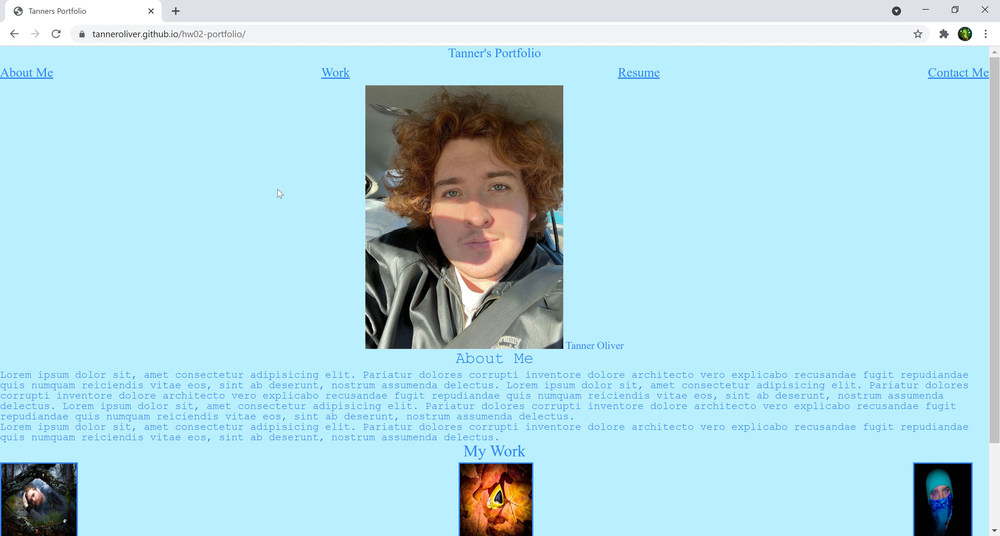
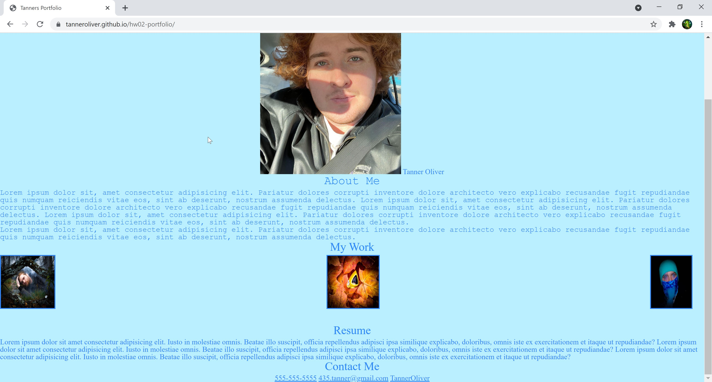

# Hw02-Portfolio
## Objective
In this homework I created a portfolio. Using HTML and CSS to create this. I added photo's with links to some github repo's I have.
## Screenshot

## Deployed Page
https://tanneroliver.github.io/hw02-portfolio/